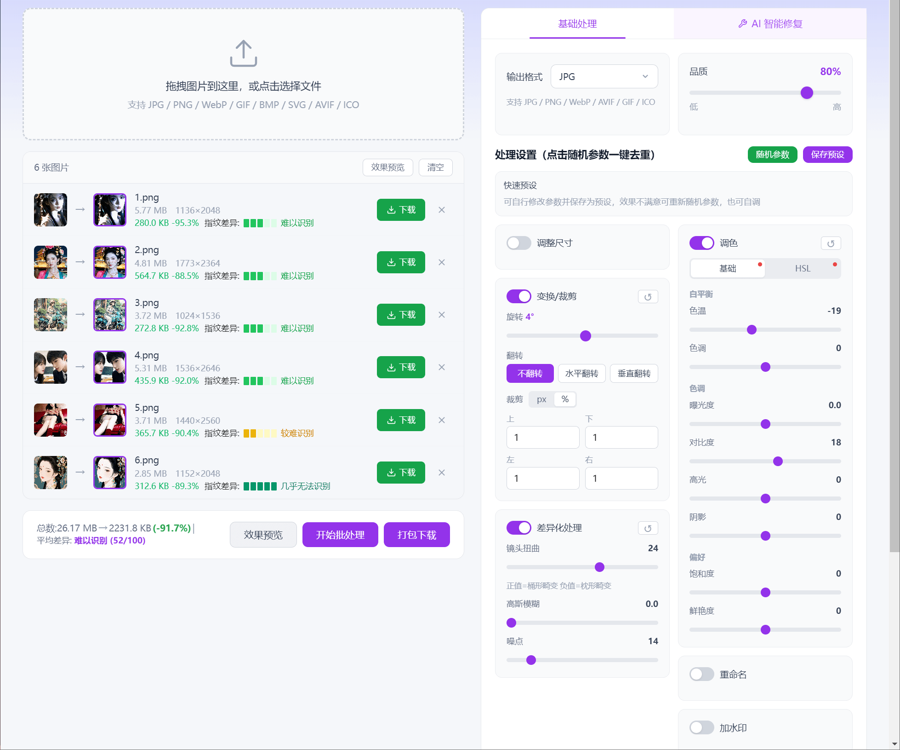
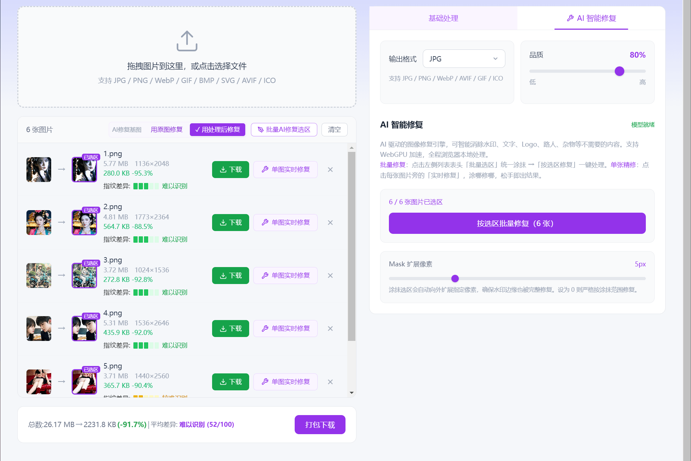
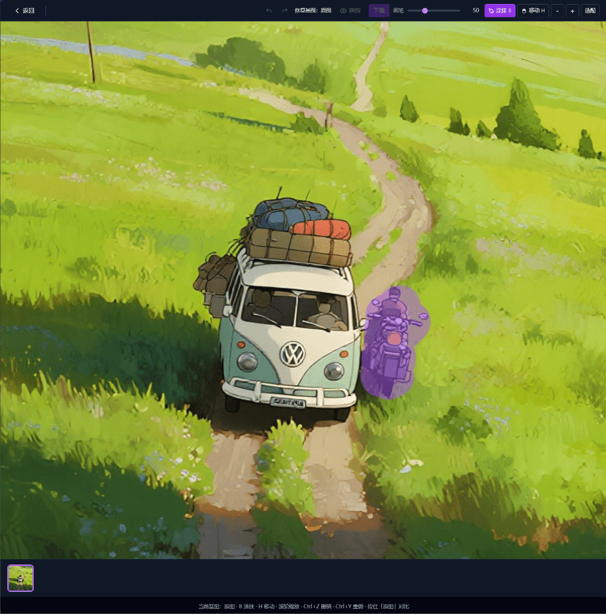
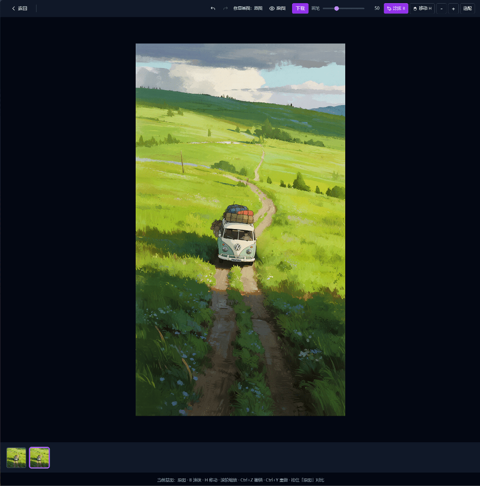
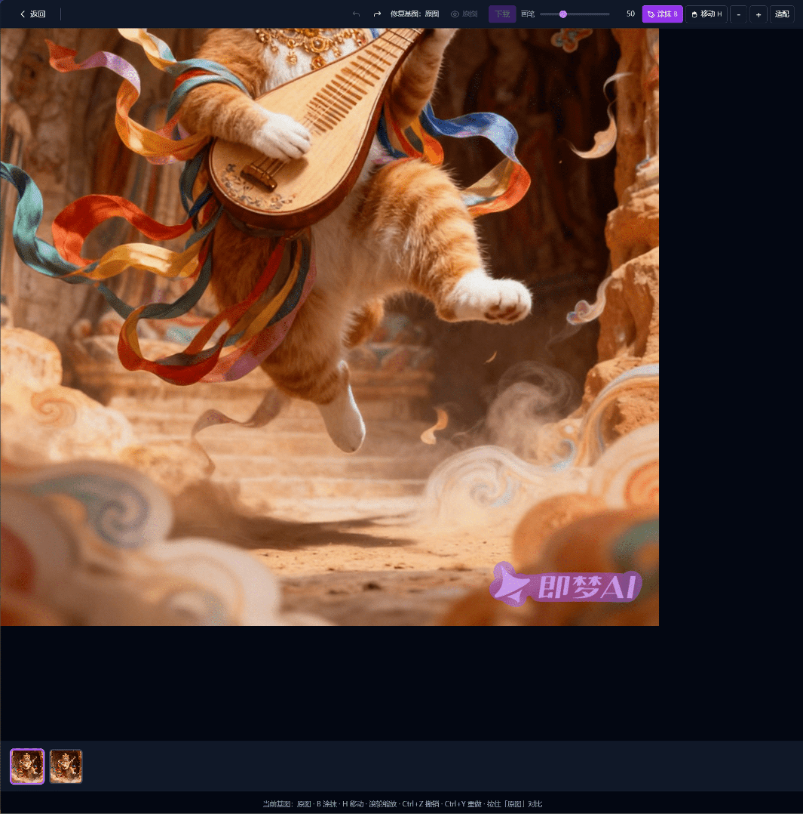
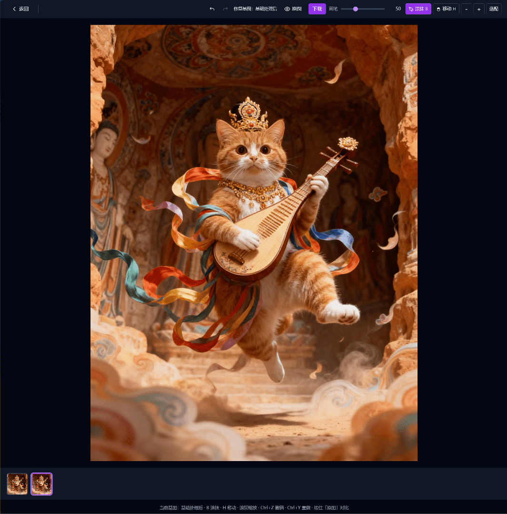

# zhiziX-pic — 智子X 智能图像处理工作站

- **全网首个免费在线、带指纹对比的图片去重 + AI 智能修复工具**

- **AI 驱动的图像修复引擎，可智能消除水印、文字、Logo、路人、杂物等不需要的内容，支持 WebGPU 加速**

- **Lightroom 级别的 HSL 调色和镜头扭曲，搬到了浏览器里**

- **感知哈希指纹检测引擎，自带图片指纹检测功能**

- **随机参数，批量一键去重**

- **核心算法使用 Rust 编写并编译为 WebAssembly**

- 图片不上传服务器，全程浏览器本地处理，保护隐私安全


[🚀前往智子X使用->zhizi.com](https://zhizix.com)


## 和其他工具有什么不同

- 大多数在线图片工具只能简单裁剪调色，处理完就结束了。

> 这个工具多做了一步：**处理完自动告诉你，结果图和原图的差异有多大**。用的是**感知哈希算法**，和主流内容平台同类。













## 功能

- **AI 智能修复** — 智能消除水印、文字、Logo、路人、杂物，支持 WebGPU 加速，全程浏览器本地推理
- **批量选区修复** — 在一张图上涂抹选区，一键批量应用到所有同比例图片
- **单张实时精修** — 涂哪修哪，松手即出结果，支持多次迭代、撤销/重做、原图对比
- **批量处理** — 拖拽上传多张图片，一次处理
- **格式转换** — JPG、PNG、WebP、AVIF、GIF、ICO（WASM 加速编码）
- **变换** — 旋转、翻转、裁剪，自动去除旋转黑边
- **调色** — 色温、色调、曝光、对比度、高光、阴影、饱和度、鲜艳度
- **HSL 混合器** — 8 通道色相/饱和度/明度独立控制
- **差异化处理** — 镜头扭曲、高斯模糊、噪点注入
- **水印** — 文字水印，支持位置和透明度设置
- **指纹检测** — 处理后实时对比原图的感知哈希差异
- **随机参数** — 随机生成一键去重的参数
- **参数预设与保存** — 可自己调节参数，并且保存复用

## 技术亮点

### 三维度指纹分析

| 维度 | 算法 | 检测能力 |
|------|------|---------|
| 结构 | pHash（DCT-II 频域变换） | 旋转、裁剪、缩放、扭曲 |
| 梯度 | dHash（差值哈希） | 结构变化的交叉验证 |
| 颜色 | 直方图交集（192-bin RGB） | 调色、噪点、模糊 |

三个维度独立评分后综合，0-100 分。单一处理类型无法同时骗过三个维度。

### 几何变体检测

-翻转和 180° 旋转不改变图片内容，但会让哈希值完全不同。引擎自动生成几何变体（水平翻转、垂直翻转、180° 旋转），取最小汉明距离——简单镜像不会虚高评分。

### WebAssembly 加速

- 核心算法（DCT、pHash、dHash、颜色处理、HSL、扭曲、模糊、噪点）全部编译为 WASM，性能提升 3-5 倍。图像处理引擎使用 Rust 编写，通过 wasm-bindgen 编译为浏览器可执行的二进制模块。

### 纯浏览器端 pHash

自研 DCT-II 实现（分离式 1D 变换，先行后列），零第三方依赖。32×32 灰度图上计算 64 位感知哈希，WASM 加速后耗时约 0.5-1ms。

### 评分模型

```
hashRaw   = (pHash距离 × 0.7 + dHash距离 × 0.3) / 64 × 100
colorRaw  = min(100, (1 - 直方图相似度) × 200)

hashScore  = min(60, hashRaw × 0.6)        // 结构维度，上限 60
colorScore = min(60, colorRaw × 0.6)       // 颜色维度，上限 60
crossBonus = min(20, hashRaw/100 × colorRaw/100 × 80)  // 交叉增益

最终分数 = min(100, hashScore + colorScore + crossBonus)
```

经过 5 种图片风格（CG、人像、插画、风景、产品图）× 30 个参数组合 × 100次脚本处理的交叉验证，跨图片方差 < 15%。

### 旋转与扭曲的黑边处理

- **旋转**：计算保持原始宽高比的最大内接矩形，自动裁掉黑色边角
- **扭曲**：越界坐标钳位到边缘像素，而不是填充黑色

### WASM 编码

Worker 线程池 + WASM 编码器（mozjpeg、libwebp、libavif、oxipng、imagequant），编码失败自动降级到 Canvas API。

## 隐私

**零服务器依赖。** 所有处理（包括 AI 智能修复）通过 OffscreenCanvas、Web Workers 和 WebGPU 在浏览器内完成。图片不会离开你的设备。没有分析、没有追踪、没有上传。